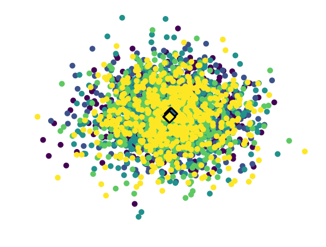

# Stochastic Gradient Langevin Dynamics for Bayesian learning

This was a final project for Berkeley's [EE126](http://inst.eecs.berkeley.edu/~ee126/sp19/) class in Spring 2019: [__Final Project Writeup__](EECS126_Final_Project_SGLD.pdf)

This repository contains code to reproduce and analyze the results of the paper ["Bayesian Learning via Stochastic Gradient Langevin Dynamics"](https://www.ics.uci.edu/~welling/publications/papers/stoclangevin_v6.pdf). We evaluated the performance of SGLD as an ensembling technique, performed visualizations of the class activations for the model samples from the posterior, and estimated the model uncertainty by measuring the Shannon entropy of the model predictions in different setups.

## Running SGLD

This repository uses the [skeletor](https://github.com/noahgolmant/skeletor) framework for experiment orchestration and metric analysis.

To train the models for all noise scale configurations, use:
`python -m sgld.train --config config.yaml sgld`

To run an experiment, use:
`python -m sgld.analysis --mode <experiment> <experimentargs> analysis`

The code to reproduce the plots from the writeup can be found in `notebooks/`.

Here is a cool visualization:

Each dot is a two-dimensional projection of the pre-activations for the final linear layer of the network. We project all the points from a single class using this technique, and repeat it for each model in the ensemble. Lighter color (from purple to yellow) indicates a model obtained later in training. The diamonds represent the class centroids for each model.

# Acknowledgements

The PyTorch t-SNE code is a modification of Chris Moody's implementation [here](https://github.com/cemoody/topicsne/).
